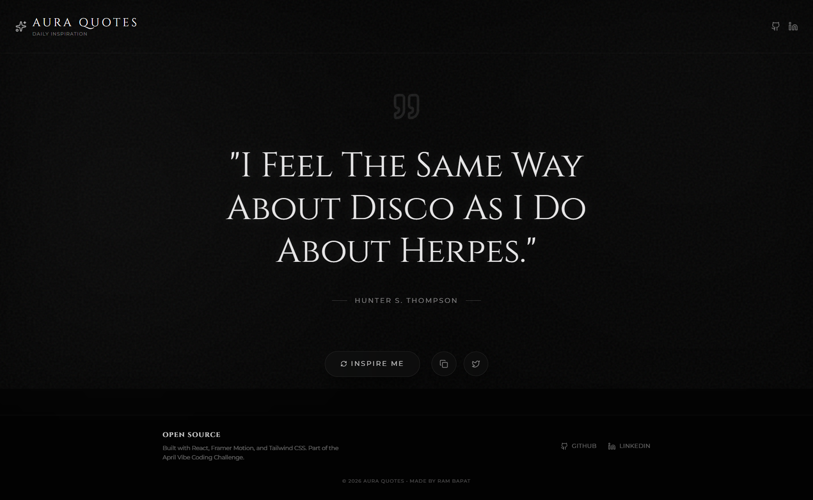
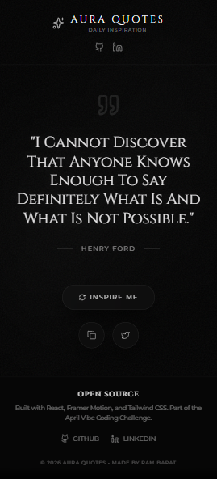

# ✨ Aura Quotes: Premium Daily Inspiration

    

**Day 13 / 30 - April Vibe Coding Challenge**

## 🔗[Live Demo](https://aura-quotes.vercel.app/)

**Aura Quotes** is a highly premium, minimalist daily quote generator. It pulls from a massive dataset of over 1,400 quotes, ensuring you never run out of inspiration.

## 📸 Screenshots





## ✨ Features

*   **📚 Massive Dataset:** Uses a free API to fetch over 1,400 high-quality quotes instantly on load.
*   **🎭 Premium Animations:** Features cinematic blur-fades and smooth layout transitions powered by Framer Motion.
*   **🌌 Aesthetic Design:** A deep, dark theme with a subtle animated mesh gradient and SVG noise overlay for a textured, glassmorphic feel.
*   **📋 Quick Actions:** Instantly copy quotes to your clipboard or share them directly to Twitter with a single click.
*   **📱 Fully Responsive:** Perfectly scaled typography and layout for mobile, tablet, and desktop.

## 🛠️ Tech Stack

*   **Frontend Framework:** React 19 + Vite
*   **Styling:** Tailwind CSS 4 (Custom Premium Theme)
*   **Animations:** Framer Motion (`motion/react`)
*   **Icons:** Lucide React
*   **API:** DummyJSON Quotes API

## 🚀 Getting Started

### 1. Clone the Repository
```bash
git clone https://github.com/Barrsum/Aura-Quotes.git
cd Aura-Quotes
```

### 2. Install Dependencies
```bash
npm install
```

### 3. Run the App
```bash
npm run dev
```

## 👤 Author

**Ram Bapat**
*   [LinkedIn](https://www.linkedin.com/in/ram-bapat-barrsum-diamos)
*   [GitHub](https://github.com/Barrsum)

---
*Part of the April 2026 Vibe Coding Challenge.*
